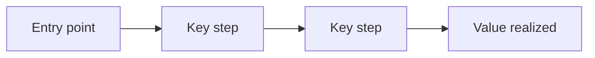

# <Project Or Feature Title>

> Status: Draft | In Review | Approved
> Created: `YYYY-MM-DD`
> Last updated: `YYYY-MM-DD`
> Owner: `<name or role>`

## Product Thesis

<One line: what this product or feature is and why it wins. Technology comes
later, in service of this.>

## Hero Flow

<The single demo that proves the value: who enters, what they do, and what payoff
they reach.>

## Executive Summary

<One paragraph covering what it is, who it is for, and why it matters now.>

## Problem And Context

### Problem

<The problem being solved.>

### Users Affected

<Who has the problem and how often.>

### Current Workaround

<How the problem is handled today and why that is inadequate.>

### Why Now

<The timing driver.>

## Users And Personas

| Persona | Goal | Pain | Success Criteria |
|---|---|---|---|
| `<persona>` | `<goal>` | `<pain>` | `<measure>` |

## Launch Scope

The v1 scope contains only what the hero flow needs.

### In Scope

| Feature | Requirement | Acceptance Criteria |
|---|---|---|
| `<feature>` | `<requirement>` | `<observable done condition>` |

### Deferred Roadmap

| # | Item | Why Deferred | Trigger To Revisit |
|---|---|---|---|
| 1 | `<item>` | `<reason>` | `<observable trigger>` |

### Explicitly Out Of Scope

- `<item>` - `<reason>`

## Technical Approach

### Architecture

<High-level approach. Link to `architect-design` output when one exists.>

### Data Model And Ownership

<Entities, ownership, tenancy, lifecycle states, and expensive-to-change choices.>

### Integrations

| Integration | Purpose | Owner | Risk |
|---|---|---|---|
| `<service>` | `<purpose>` | `<owner>` | `<risk>` |

### Dependencies

| Package | Function | License | Maintenance Evidence | Decision |
|---|---|---|---|---|
| `<package>` | `<function>` | `<license>` | `<source checked on YYYY-MM-DD>` | Adopt / Avoid / Review |

## UX Notes

| Screen Or Step | Purpose | Notes |
|---|---|---|
| `<screen>` | `<purpose>` | `<notes>` |

## Risks And Mitigations

| Risk | Probability | Impact | Mitigation |
|---|---|---|---|
| `<risk>` | Low/Medium/High | Low/Medium/High | `<mitigation>` |

## Testing And Quality

| Area | Required Evidence |
|---|---|
| Unit / integration | `<tests>` |
| End-to-end / browser | `<flows>` |
| Security / auth | `<checks>` |
| Regression | `<what must not break>` |
| Manual proof | `<when automated coverage is unavailable>` |

## Decisions

| # | Decision | Choice | Owner | Rationale | Date |
|---|---|---|---|---|---|
| 1 | `<what was ambiguous>` | `<choice>` | `<owner>` | `<why>` | `YYYY-MM-DD` |

## Open Questions

Only include questions that genuinely cannot be decided yet.

| # | Question | Owner | Needed By | Status |
|---|---|---|---|---|
| 1 | `<question>` | `<owner>` | `YYYY-MM-DD` | Open |

## References

- `<link>`

## Change Log

| Date | Author | Change |
|---|---|---|
| `YYYY-MM-DD` | `<author>` | Initial draft |
